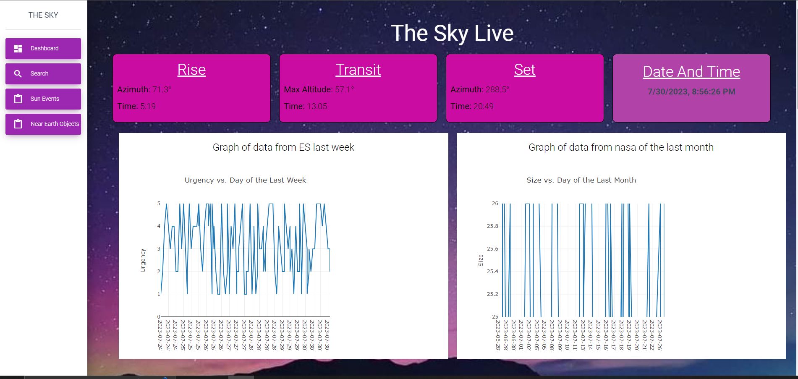
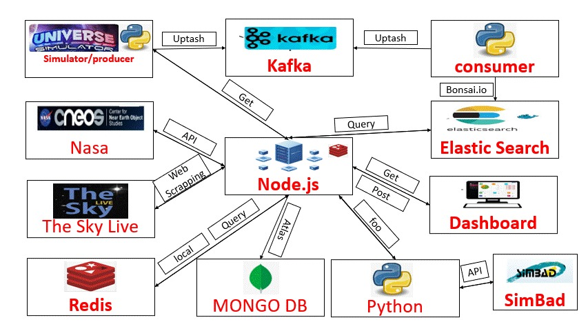
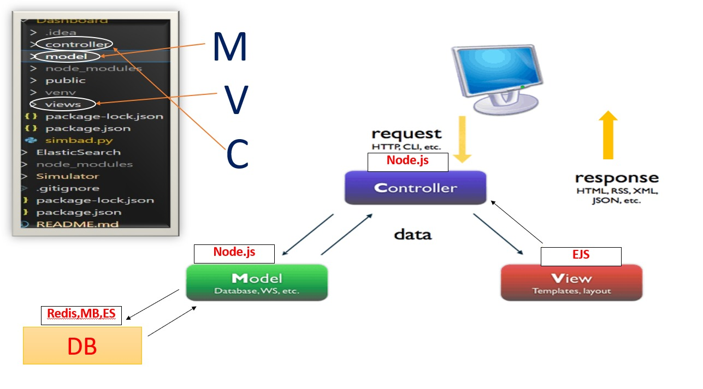

# Astronomy Event Alert System

## Introduction

The Astronomy Event Alert System is a sophisticated data processing application that addresses the challenges of real-time astronomical event monitoring. It empowers businesses to transform vast volumes of stored data into operational insights, enabling risk management and data-driven decision-making. The system is designed to support modern organizational management, especially in scientific fields such as medical research and astronomy.

## Key Features

- **Real-time Alerts:** The system provides real-time alerts for various astronomical events, such as gamma-ray bursts, significant changes in apparent brightness, UV rise, X-ray rise, comets, and more.
- **Message Simulator:** It includes a message simulator to simulate astronomical event data ingestion, enabling testing and development.
- **Storage and Retrieval:** Event data is stored and can be easily retrieved for investigation and search purposes.

## Background

In recent years, data processing systems have been at the forefront of technological challenges. In the business world, the ability to operationalize massive amounts of stored data has become a valuable asset, allowing risk management and data-driven decision-making based on insights learned from these data. In scientific fields such as medical research and astronomy, where vast amounts of data are accumulated at exponential rates, methods, technologies, and infrastructures are required to cope with the challenges efficiently and quickly.

The inspiration for this project comes from a relevant article and an existing GitHub repository. Astronomical events generate physical signals such as gravitational waves or electromagnetic radiation across various wavelengths, including radio, microwave, infrared, visible light, ultraviolet, X-ray, and gamma-ray. These events, also known as "transients," are crucial for time-based astronomical research.

## Functional Requirements

- **Single-User System:** The system is designed for a single user and does not require user management.
- **Local Star Catalog:** The system maintains a local copy of the Bright Star Catalog to reference celestial objects.
- **Message Ingestion:** The system ingests messages from a simulator, containing event details like date, observer, coordinates, event type, and urgency level.
- **Real-time Dashboard:** The latest events are displayed in real-time on the dashboard.
- **Event Search and Filtering:** Users can search and filter events based on various parameters.

## Non-Functional Requirements

- **Architecture:** The system follows the Lambda architecture, and services are implemented using the Microservices pattern.
- **Application Server:** The main application server is built with Node.js and Express.js, with the option to integrate Python/FastAPI services.
- **Caching and Storage:** Redis is used as a caching layer, and MongoDB is used for machine learning data storage.
- **Message Streaming:** Kafka is used for message streaming, and Elasticsearch is utilized for search capabilities.

## Getting Started

Follow these steps to get the system up and running:

1. Clone the repository: `git clone https://github.com/oriazadok/big_data.git`
2. Install dependencies: `npm install <dependencies>`
3. Set up Apache Kafka,Elasticsearch and Redis servers.
4. Start the application server: `npm start`
5. Access the system through the provided URL.

## Usage

- Once the application is running, real-time alerts for astronomical events will be displayed on the dashboard.
- Users can utilize the search feature to filter events based on their preferences.

## API Keys

To enable full functionality, obtain API keys for the NASA Near-Earth Object Program (NeoWs) and The Sky Live APIs and Simbad. Insert these keys in the appropriate files.

## Illustration

 
 
 
 

## Video Demonstration
Check out the video demonstration [here](https://youtu.be/Ncf8nlj_n_w).
